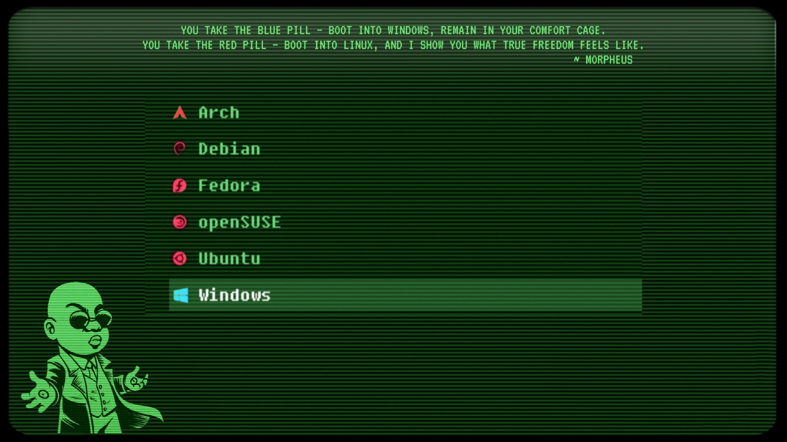

# Matrix GRUB Theme (Custom by Kartik Halkunde)

A customized GRUB theme inspired by the **Matrix** universe, blending the aesthetics of classic terminal hacking with modern bootloader design. This theme pays tribute to the iconic **red pill / blue pill** choice — where GRUB itself offers you the decision:  
Choose 🟥 Linux, or 🟦 Windows.

## Theme Features

-  **Retro green-on-black Matrix aesthetic**
-  **Themed boot menu** mimicking the red pill / blue pill decision
-  Highlighted entries with glowing selection effect
-  Optimized for modern widescreens (1080p and higher)
-  Text-based layout with stylish alignment and neat glyphs
-  A nostalgic experience straight out of a cyberpunk dream

## ⚙️ OS Entry Mapping

- 🟥 **Red Pill** → Linux (Arch, Ubuntu, etc.)
- 🟦 **Blue Pill** → Windows

The layout and language make your boot process feel like you're hacking into the Matrix itself.

## Based On

This is a **customization of the original [Fallout GRUB theme](https://github.com/shvchk/fallout-grub-theme)** by [shvchk](https://github.com/shvchk), modified to reflect the mood and design of the Matrix trilogy.

### Custom Changes:
- Matrix-inspired background and vibe
- Color scheme switched to green, black, red, and blue
- Modified `theme.txt` to realign entries and enhance contrast
- New background image (custom artwork or Matrix-inspired visuals)


## Theme Preview




## Installation

```bash
git clone https://github.com/KartikHalkunde/Matrix-GRUB-theme.git
sudo cp -r Matrix-GRUB-theme /boot/grub/themes/Matrix
```
Edit /etc/default/grub:

GRUB_THEME="/boot/grub/themes/Matrix/theme.txt"

Update grub:

sudo grub-mkconfig -o /boot/grub/grub.cfg

 Credits

    Based on shvchk's Fallout GRUB Theme


---

### 4. Upload to GitHub

```bash
cd ~/Matrix-GRUB-theme
git init
git add .
git commit -m "Customized Matrix GRUB theme"
git remote add origin https://github.com/YOUR_USERNAME/Matrix-GRUB-theme.git
git push -u origin main
```
